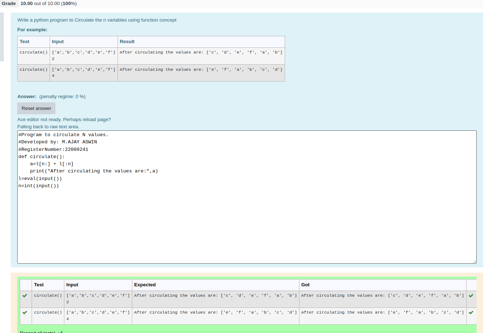

# Circulate-the-values-of-N-variables
## Aim:
To write a python program to circulate the n variables using function concept
## Equipment’s required:
PC
Anaconda - Python 3.7
## Algorithm: 
### Step 1: 
Define a funtion name
 
### Step 2: 
Get the value from the user for the number of rotation

### Step 3: 
Using the slicing concept rotate the list

### Step 4: 
add the two values
### Step 5: 
print that final list

### Step 6:
call the function with function name

## Program:
```
#Program to circulate N values.
#Developed by: M.AJAY ASWIN
#RegisterNumber:22009241
def circulate():
    a=l[n:] + l[:n]
    print("After circulating the values are:",a)
l=eval(input())
n=int(input()) 
```

## Output:


## Result:
Thus the experiment was executed successfully..
